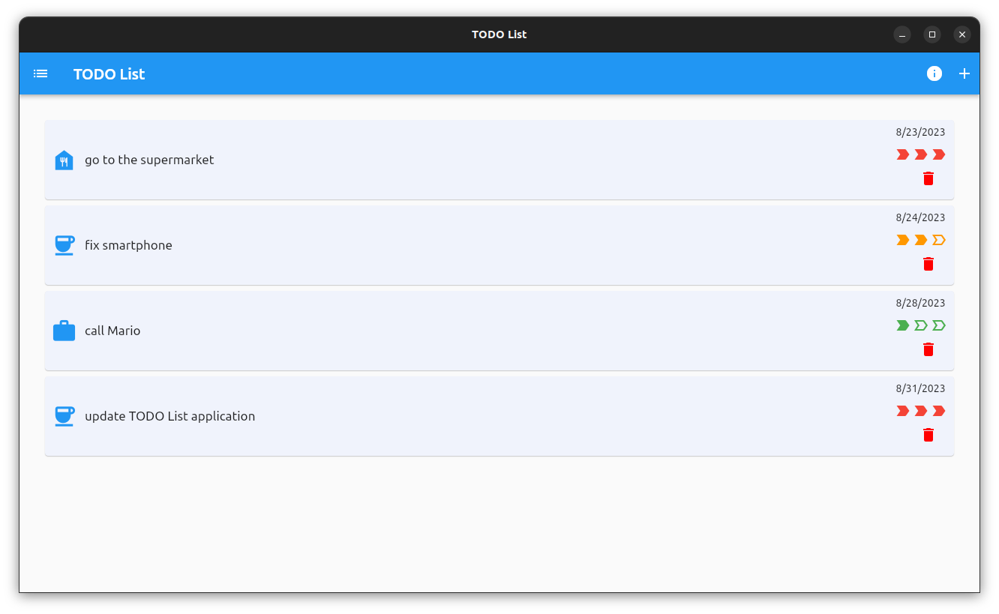
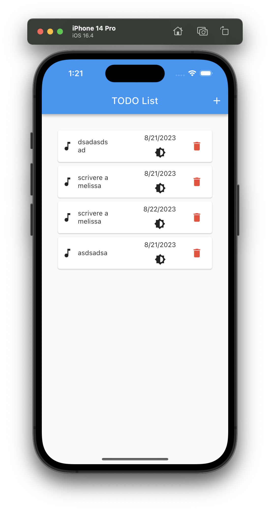

# TODO List

A simple TODO List implemented using Dart programming language and Flutter Framework.

|                  Screenshots                  |
| :-------------------------------------------: |
|    |
|  |

### create a snap package

```
snapcraft --debug
```

### install snap package

```
snap install todolistapp_0.2.0_amd64.snap
```

### run snap package

```
snap run todolistapp
```

### remove snap package

```
snap remove todolistapp
```

[](https://snapcraft.io/todolistapp)
