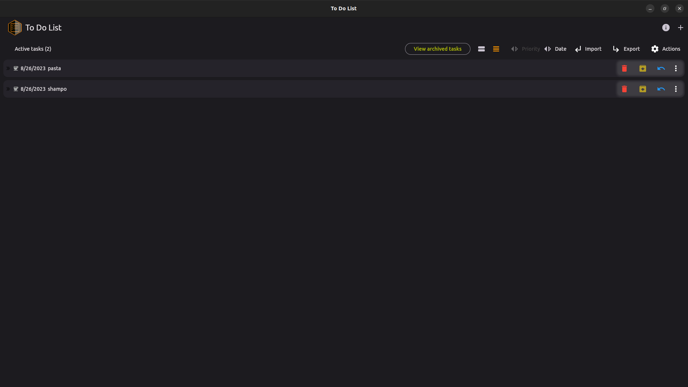

# TODO List

A simple TODO List application implemented using Dart and Flutter. The software stores all personal tasks locally (using a SQLite database). The application allows to categorize tasks, give a priority to the task and set a task due date.

# Download

TODO List application can be installed on your Ubuntu machine from the snap store:

|                 Screenshots                 |                                             |
| :-----------------------------------------: | :-----------------------------------------: |
|  |  |
|  |  |
