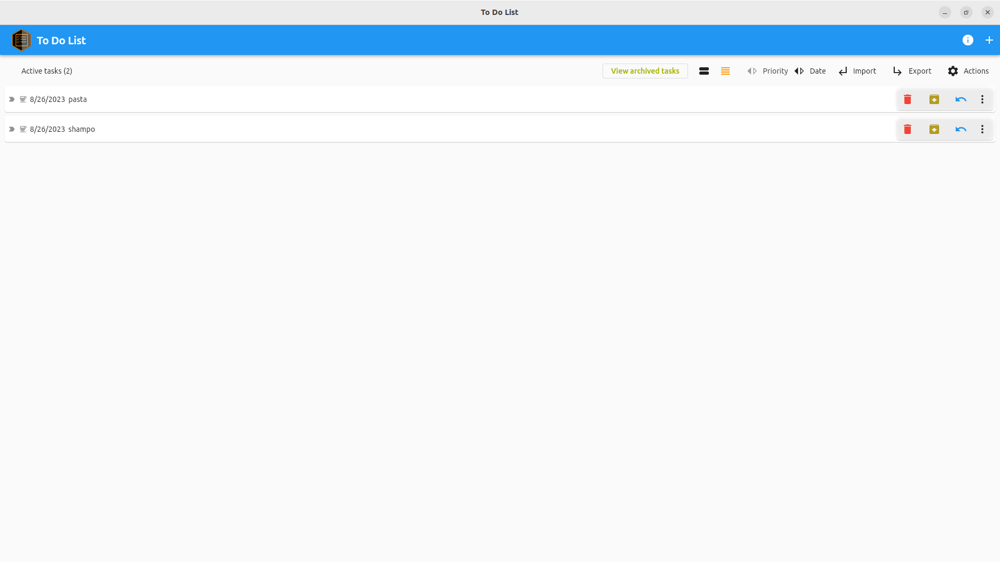
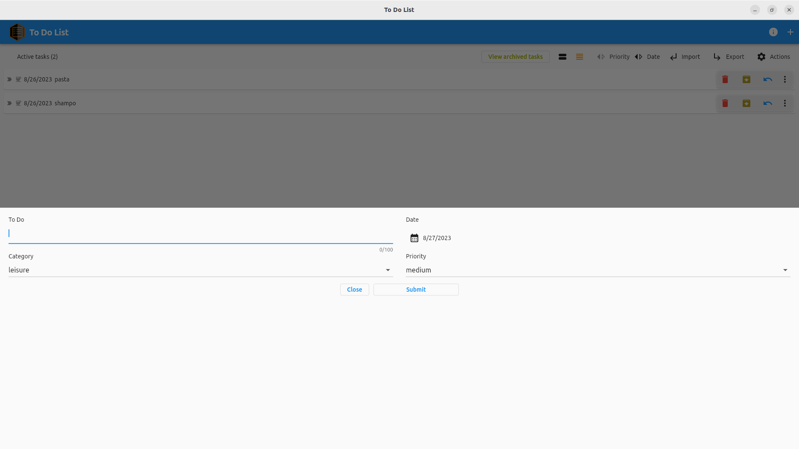

# TODO List

A simple TODO List application implemented using Dart and Flutter. The software stores all personal data locally (using a SQLite database). The application allows to categorize tasks, give a priority to the task and set a task due date. This is the first version and new versions of software will come soon.

# Download

TODO List application can be installed on your Ubuntu machine from the snap store:

|                 Screenshots                 |                                             |
| :-----------------------------------------: | :-----------------------------------------: |
|  |  |
|  |  |

# v. 0.1.0

features:

- add/remove todo task

# v. 0.2.0

- dark mode
- change task status to done/undone
- insert date and update date db columns
- archive/unarchive task
- view active/archived tasks
- sort by date/priority
- increased input length for task description to 100 characters

If you found a bug, please [contact me](http://andre-i.eu/#contactme).
